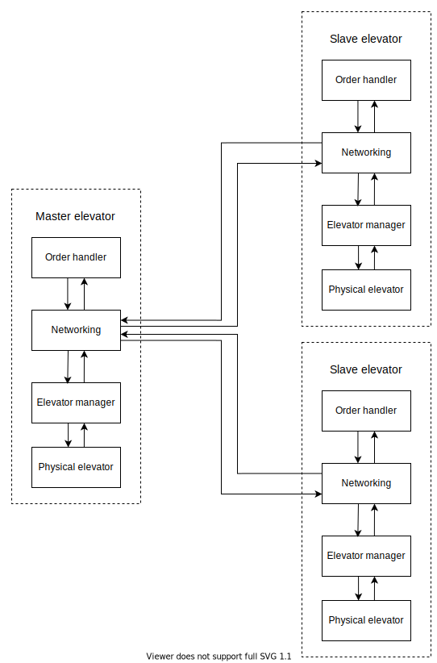

Elevator project
===========================

Repository for group 74's solution to the elevator project in TTK4145. See [project descripton](project_description.md) for details about the project.

Modules and network topology
------------------------------------

This image shows interconections between modules and elevators. Connection arrows represent Go channels. Connections between elevators are technically network connections, but they are abstracted as Go channels by the network module.

Code organization
------------------------------------
The code is organized in several Go packages, together forming one Go module called elevatorproject.  The packages are

- [main](main.go)
    - Main package. Initializes system to the module topology described in previous section
- [config](config)
    - Contains general constants that defines configuration specific information about the system
- [elevio](driver-go/elevio)
    - Go driver for physical elevator
- [elevatorManager](elevatorManager)
    - The elevator manager module
- network
    - [bcast](network/bcast)
        - Utilities for simple listening and broadcasting with UDP
    - [bcast_with_ackCtrl](network/bcast_with_ackCtrl)
        - Utilities for connecting go channels over network connections using UDP broadcast with acknowledgements and resends
    - [conn](network/conn)
        - Gives UDP broadcasting a similar interface across operating systems
    - [localip](network/localip)
        - Utility for finding a elevators local IP address
    - [peers](network/peers)
        - Utilities for staying in touch with units across network and get notified when a connection breaks
    - [switcher](network/switcher)
        - Utility for routing traffic through Go channels differently based on network connectivity
- [orderHandler](orderHandler)
    - The order handler module
- [orders](orders)
    - Useful types for managing orders
- [utils](utils)
    - General utilities
